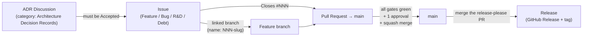
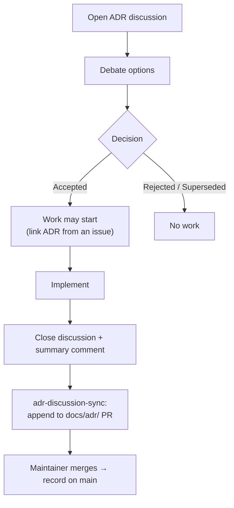
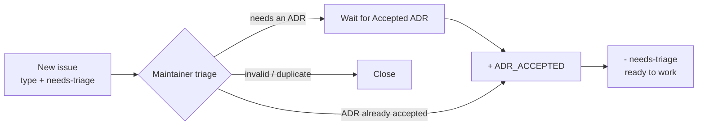
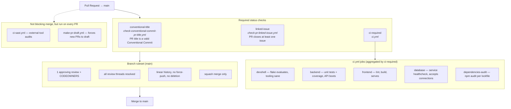
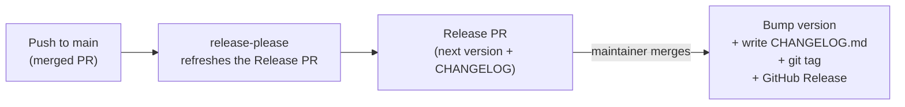

# Contributing to Zero-To-Kaban

This repository is **strictly governed**. Nothing reaches `main` except through a
pull request, and every pull request has to trace back to an issue, which in turn
traces back to an *accepted* Architecture Decision Record.

This document explains that chain and the CI/CD gates that enforce it.

---

## The governance chain



**Rule of thumb:** you can always work *ahead* (write a branch, draft an issue),
but you cannot *merge* ahead. Each link in the chain must exist before the next
one can be completed.

| To do this...            | You first need...                                             |
| ------------------------ | ------------------------------------------------------------- |
| Start work on an issue   | A linked ADR discussion marked **Accepted**                  |
| Create a feature branch  | An existing issue the branch is linked to                    |
| Open a pull request      | An existing issue the PR will close (`Closes #NNN`)          |
| Merge to `main`          | A green PR with 1 approval, passing every required check     |
| Cut a release            | Merge the automatically maintained `release-please` PR       |

---

## 1. Architecture Decision Records (ADRs)

Any change that affects architecture, tooling, data model, or a cross-cutting
convention starts as an **ADR discussion**.

All ADRs live in one place:
[**/discussions/categories/architecture-decision-records**](https://github.com/Julian52575/Zero-To-Kanban/discussions/categories/architecture-decision-records?discussions_q=)

1. Open a discussion in that **Architecture Decision Records** category using the
   discussion template. Fill in *Context*, *Options*, *Decision*, *Impact size*.
2. Discuss. When consensus is reached, set the **Decision** field to `Accepted`
   (or `Rejected` / `Superseded`).
3. Once the decision is implemented, leave a final summary comment and **close**
   the discussion.

Closing the discussion triggers the `adr-discussion-sync` workflow, which mirrors
the discussion (body + every comment) into `docs/adr/<title>.md` and appends it to
a long-lived pull request. The record only lands in `main` when a maintainer
merges that PR — same integration-branch pattern as `release-please`.



> A **placeholder issue** may be created without an accepted ADR link, but it
> should not be *worked on* until the ADR discussion exists and is `Accepted`.

---

## 2. Issues

- **Blank issues are disabled.** Use one of the four forms: **Feature**, **Bug**,
  **R&D**, **Debt**.
- The Feature / R&D / Debt forms have an **ADR discussion** field. A link
  to an `Accepted` discussion from
  [/discussions/categories/architecture-decision-records](https://github.com/Julian52575/Zero-To-Kanban/discussions/categories/architecture-decision-records?discussions_q=)
  must be included before the issue is picked up.   
  Reviewers should add the `ADR_ACCEPTED` label to issues linking to a accepted ADR.
- Security vulnerabilities are **never** filed as issues — use a private
  [security advisory](https://github.com/Julian52575/Zero-To-Kanban/security/advisories/new).

Every pull request must close at least one issue, so the issue must exist
**before** the PR is opened.

---

## 3. Labels

Labels are how an issue's *type*, *state*, and *origin* are tracked. Some are set
by the issue forms, some by automation, and some are added by reviewers during
triage.

### Set automatically by the issue forms

| Label          | Meaning |
| -------------- | ------- |
| `feature`      | Opened with the **Feature** form — a new capability or enhancement |
| `bug`          | Opened with the **Bug** form — something is broken |
| `research`     | Opened with the **R&D** form — a spike / investigation, outcome unknown |
| `debt`         | Opened with the **Debt** form — cleanup, refactor, or maintenance |
| `needs-triage` | Every new issue gets this. A maintainer removes it once the issue is understood, sized, and ready to be picked up |

### Governance / workflow state (added by reviewers)

| Label          | Meaning |
| -------------- | ------- |
| `ADR_Required` | Issue has no ADR yet. |
| `ADR_Proposed` | A proposed ADR is linked. |
| `ADR_Accepted` | The issue links to an **Accepted** ADR discussion. Work should not start until this label is present (placeholder issues may exist without it) |

### Added by automation — do not set these by hand

| Label         | Set by | Meaning |
| ------------- | ------ | ------- |
| `jira-auto`   | `jira-issues-sync.yml` | Issue is mirrored to a Jira task; the Jira key is stored as a hidden marker in the issue body |
| `openssf`     | `openssf-scorecard.yml` | Issue carries the weekly OpenSSF Scorecard findings |
| `auto-update` | `openssf-scorecard.yml` | Issue or PR is opened/refreshed by a workflow, not a person |

### Triage flow



> When adding a brand-new label, create it with a description (see the
> `gh label create ... -d '...'` calls in the workflows) and document it here in
> the same PR.

---

## 4. Branching & commits

**The feature branch and the issue must be linked.** Create the branch from the
issue page (GitHub's *Create a branch* button links them automatically), or name
it with the issue number as the prefix so the link is unambiguous:

```bash
nix develop            # enter the dev shell (shared toolset)
git switch -c <NNN>-short-description   # NNN = issue number, e.g. 59-split-frontend-and-backend
just up                # run the stack locally
```

A branch with no corresponding issue should not exist — if you started coding
before filing the issue, open the issue and rename the branch to match.

- **No direct pushes to `main`** — the branch ruleset rejects them.
- **Linear history only** — no merge commits on `main`; rebase your branch.
- Commits follow the [Conventional Commits](https://www.conventionalcommits.org/en/v1.0.0/#summary) format.   
  The local hook in `.githooks/` checks this;
  install hooks with the nix develop setup.

| Commit type        | Version effect (`release-please`) |
| ------------------ | -------------------------------- |
| `fix: ...`         | patch — `x.x.+1`                 |
| `feat: ...`        | minor — `x.+1.x`                 |
| `feat!:` / `BREAKING CHANGE:` | major — `+1.x.x`      |
| `docs`, `ci`, `chore`, `refactor`, `test`, ... | no release |

---

## 5. Pull requests

Open the PR against `main` and fill in the template:

- `Closes #NNN` — **required**, the issue this PR resolves.
- PR **title must be a Conventional Commit** (it becomes the squash-merge commit
  message).
- New PRs are **automatically converted to draft** by `make-pr-draft`. Click
  **Ready for review** and pick reviewers when you are done coding.
- Resolve every review thread; **1 external approval** is required, plus a
  **CODEOWNERS** review where applicable.
- Merge method is **squash** only.

### The PR gate

A PR to `main` is blocked until all of these are green. The branch ruleset marks
`ci-required`, `conventional-title`, and `linked-issue` as **required status
checks** (`strict` — the branch must also be up to date with `main`).



| Check / workflow                         | What it enforces |
| ---------------------------------------- | ---------------- |
| `conventional-title`                     | PR title (and single-commit message) is a Conventional Commit, lower-case subject, no trailing period |
| `linked-issue`                           | PR has a real closing reference (`Closes #NNN` or a UI link) |
| `ci-required` &larr; `devshell`          | `flake.nix` evaluates; dev shell exposes the expected tools |
| `ci-required` &larr; `backend`           | Backend unit tests pass with coverage; migrations apply; API responds |
| `ci-required` &larr; `frontend`          | Frontend lints, builds, and serves |
| `ci-required` &larr; `database`          | DB service passes its healthcheck and accepts connections |
| `ci-required` &larr; `dependencies-audit`| `npm audit` on each workspace lockfile |
| `ci-sast-required` (`ci-sast.yml`)       | External tool audits; commits `.sast/report/**` back to the branch. No-ops on drafts and self-commit. |

> Mark the PR **Ready for review** to run the full gate.


### Checklist before you open a PR

- [ ] An **Accepted** ADR discussion exists for architectural changes
- [ ] An **issue** exists, and the branch is **linked** to it (name prefixed with `NNN-`)
- [ ] The PR body says `Closes #NNN`
- [ ] Branch is **rebased** on `main` (linear history)
- [ ] Commits and the **PR title** are Conventional Commits
- [ ] Tests added/updated; docs updated if behaviour changed
- [ ] AI-assisted changes reviewed line-by-line by a human
- [ ] PR marked **Ready for review** with reviewers assigned


---

## 6. Releasing

Releases are **not** cut by hand thanks to Continuous Delivery.



- `release-please` keeps one long-lived **Release PR** open against `main`,
  computing the next version from Conventional Commit history since the last tag.
- Merging that PR bumps `package.json`, writes `CHANGELOG.md`, creates the tag
  (no `v` prefix), and publishes the GitHub Release.
- Multiple breaking changes between releases collapse into a **single** major bump.

---

## 7. Related automation

| Workflow                  | Trigger                        | Purpose |
| ------------------------- | ------------------------------ | ------- |
| `adr-discussion-sync.yml` | ADR discussion closed          | Mirror the ADR into `docs/adr/` via a long-lived PR |
| `jira-issues-sync.yml`    | Issue opened / closed / reopened | Keep a linked Jira task in sync |
| `openssf-scorecard.yml`   | Weekly (Mon 09:00 UTC)         | Security posture audit; opens an issue + pre-filled PR link |
| `release-please.yml`      | Push to `main` (app code)      | Maintain the Release PR |

---
